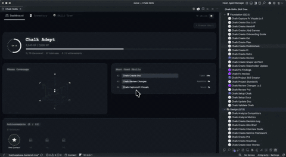

# Chalk Skills



Turn your AI agent skills into a game. Track usage, earn XP, unlock achievements, and visualize your skill library with an RPG-inspired VS Code extension.

## Quick Start

**Option A: Start from scratch**

1. Install the extension
2. Open any project in VS Code
3. Run `Chalk Skills: Init` from the Command Palette (`Cmd+Shift+P`)
4. Three sample skills are created in `skills/` — start exploring

**Option B: Create a skill**

Run `Chalk Skills: Create New Skill` — you'll be prompted for a name, description, risk level, and tools. A v3 SKILL.md file is generated and opened.

**Option C: Already have skills**

If your project has `skills/*/SKILL.md` files, the extension activates automatically. Click the Chalk Skills icon in the Activity Bar.

## What It Does

**Dashboard** — Player level, XP bar, phase coverage radar, achievement badges, and a most-used skills leaderboard.

**Inventory** — Browse skills as collectible cards with rarity tiers (common, rare, epic). Filter by phase, search by name, and see usage stats.

**Skill Tree** — Collapsible phase-based tree with progress bars. Jump between phases instantly. See which skills are locked vs discovered.

**Auto-Recording** — When an AI agent reads a SKILL.md file, usage is recorded automatically. No manual tracking.

**Auto-Classification** — Skills are categorized into development phases (Foundation, Design, Architecture, Engineering, Development, Launch) using pattern matching and TF-IDF classification.

## Skill File Format (v3)

Each skill is a `SKILL.md` file inside a named folder:

```
skills/
  my-skill/
    SKILL.md
```

### Full v3 spec

```yaml
---
# ── Identity ──
name: my-skill                        # Required. kebab-case identifier
description: What this skill does     # One sentence summary
author: project                       # Who made it (e.g. chalk, project, your-name)
version: "1.0.0"                      # Semver
metadata-version: "3"                 # Format version
license: MIT                          # Optional. For sharing/publishing

# ── Tools & Parameters ──
allowed-tools: Read, Write, Glob      # Comma-separated tools the skill can use
argument-hint: "[file path]"          # Autocomplete hint for arguments
input-schema:                         # Optional. Structured parameters (JSON Schema)
  type: object
  properties:
    target:
      type: string
      description: File path to process
  required:
    - target

# ── Behavioral Annotations (MCP-aligned) ──
read-only: false                      # Does not modify environment
destructive: false                    # Can cause irreversible changes
idempotent: true                      # Safe to run repeatedly
open-world: false                     # Reaches external systems (APIs, network)
risk-level: low                       # low | medium | high (drives XP + rarity)

# ── Activation ──
user-invocable: true                  # Can user trigger directly via command?
capabilities: docs.create, docs.update
activation-intents: create doc, write documentation
activation-events: user-prompt
activation-artifacts: .chalk/docs/**

# ── Organization ──
tags: docs, writing, templates        # Freeform tags for filtering
---

# My Skill

Detailed instructions for the agent go here as markdown.

## Workflow

1. Step one
2. Step two

## Rules

- Rule one
- Rule two
```

### Field reference

| Field | Required | Description |
|-------|----------|-------------|
| `name` | Yes | Kebab-case identifier, must match folder name |
| `description` | No | One-sentence summary |
| `author` | No | Who created the skill (default: `chalk`) |
| `version` | No | Semver string |
| `metadata-version` | No | `1`, `2`, or `3` |
| `license` | No | License for sharing |
| `allowed-tools` | No | Tools the skill can access |
| `argument-hint` | No | Autocomplete hint |
| `input-schema` | No | JSON Schema for structured parameters |
| `read-only` | No | MCP annotation: no side effects |
| `destructive` | No | MCP annotation: irreversible changes |
| `idempotent` | No | MCP annotation: safe to repeat |
| `open-world` | No | MCP annotation: external system access |
| `risk-level` | No | `low`, `medium`, `high` — drives XP and rarity |
| `user-invocable` | No | Can be triggered by user directly (default: true) |
| `capabilities` | No | Semantic capability tokens for routing |
| `activation-intents` | No | Natural language trigger phrases |
| `activation-events` | No | Lifecycle events that activate the skill |
| `activation-artifacts` | No | File globs the skill operates on |
| `tags` | No | Freeform tags for search/filtering |

### Backward compatibility

v1 and v2 skills work without changes. The loader reads `owner` as `author`, infers annotations from `risk-level`, and defaults missing fields.

## Commands

| Command | What it does |
|---------|--------------|
| `Chalk Skills: Init` | Scaffold sample skills in `skills/` |
| `Chalk Skills: Create New Skill` | Interactive skill creator with v3 template |
| `Chalk Skills: Open Dashboard` | Open the main dashboard |
| `Chalk Skills: Open Inventory` | Browse skill cards |
| `Chalk Skills: Open Skill Tree` | View the skill tree |
| `Chalk Skills: Record Skill Usage` | Manually record a skill use |
| `Chalk Skills: Refresh Skills` | Reload skills from disk |
| `Chalk Skills: Auto-Index Skills` | Run auto-classification |

## Settings

| Setting | Default | Description |
|---------|---------|-------------|
| `chalkSkills.autoRecord.enabled` | `true` | Auto-record when agents read SKILL.md |
| `chalkSkills.autoRecord.cooldownSeconds` | `60` | Cooldown between auto-recordings per skill |
| `chalkSkills.animations.level` | `full` | `full`, `reduced`, or `off` |

## XP & Progression

| Action | XP |
|--------|-----|
| Low risk skill use | +10 |
| Medium risk skill use | +25 |
| High risk skill use | +50 |
| First discovery of a skill | +100 bonus |
| Achievements | Varies |

Skills have a **rarity** based on risk level: common (low/unknown), rare (medium), epic (high).

## Building from Source

```bash
cd packages/vscode-extension
npm install
npm run compile
npm run package        # creates .vsix in build/
code --install-extension build/chalk-skills-*.vsix
```

## Contributing

1. Fork the repo
2. Create a feature branch
3. Make your changes
4. Run `npm run compile` to verify the build
5. Open a PR

## License

MIT
