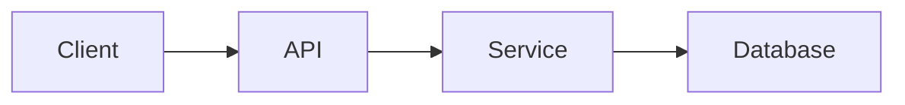

# Architecture

Last updated: YYYY-MM-DD

## System Overview

- Summary: TBD
- Key qualities (availability, latency, security): TBD

## Components

- Client(s): TBD
- API layer: TBD
- Services: TBD
- Data stores: TBD
- Infrastructure: TBD

## Data Flows

- Inbound data: TBD
- Outbound data: TBD

## Integrations

- External services: TBD
- Auth/identity: TBD

## Diagrams

